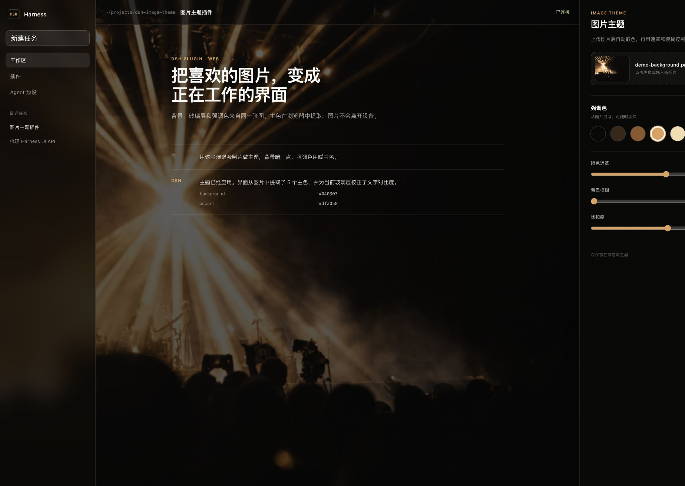

# DSH Image Theme

A Warp-inspired image theme plugin for the [DeepSeek Harness](https://github.com/deepseek-ai/deepseek-harness) web client.

Upload or drag in a picture and the plugin will:

1. extract five dominant colors in CIE Lab space;
2. turn the darkest image color into translucent glass surfaces;
3. let you choose one extracted color as the DSH accent;
4. correct text and accent contrast before applying theme tokens;
5. use the original image as the full-window background.



## Features

- Full-bleed background image with adjustable dark overlay, blur, saturation, and position.
- Deterministic five-color Lab k-means palette extraction in the browser.
- Live DSH token overrides through `ctx.theme.overrideTokens()`—no hard-coded edits to the host UI.
- A dedicated **Settings → Image theme** section with drag-and-drop upload and palette controls.
- Browser-local privacy: the image is stored as a Blob in IndexedDB and settings are stored in `localStorage`; nothing is uploaded.
- The plugin can be disabled without losing the selected image or settings.
- Responsive settings UI and reduced-motion support.

## Install

The repository includes prebuilt `lib/` artifacts, so a DSH profile can install it directly from GitHub:

```bash
dsh plugin --profile <profile-name> add github:Carpon39038/dsh-image-theme
```

Restart or refresh the DSH web client, then open **Settings → Image theme**.

To install a local checkout while developing:

```bash
pnpm install
pnpm build
dsh plugin --profile <profile-name> add link:$PWD
```

The included `.npmrc` disables automatic peer installation. This is intentional: DSH supplies the client runtime and UI services, while the current public RC packages still reference workspace-only transitive packages that are not published to npm.

## How it works

### Palette extraction

The browser downsamples the image to at most `96 × 96`, samples at most 6,000 opaque pixels, converts RGB to CIE Lab, and runs deterministic k-means with farthest-point seeding. Five clusters are sorted by population.

This follows the same broad model as Warp's open-source theme creator, which uses Lab-space Hamerly k-means with `k = 5`. This implementation is written independently for the browser and uses deterministic seeding so the same pixels always produce the same palette.

### Theme mapping

The plugin keeps the image, the dark surface color, the foreground, and the accent as separate roles:

```text
image → five-color palette → darkest color → near-black glass surfaces
                           ↘ selected color → contrast-safe accent
```

It overrides DSH's public alias tokens, including:

- `--dsw-alias-bg-base`
- `--dsw-alias-bg-layer-1`
- `--dsw-alias-bg-layer-2`
- `--dsw-alias-bg-overlay`
- `--dsw-alias-border-l1` / `--dsw-alias-border-l2`
- `--dsw-alias-brand-primary`
- `--dsw-alias-label-primary` / `--dsw-alias-label-secondary`
- `--dsw-specific-sidebar-fill`

Every override contains both `light` and `dark` values, as required by the DSH theme runtime.

### Background rendering

A plugin-owned fixed backdrop sits behind the DSH root. The application tokens stay translucent, allowing the image to show through while the overlay and surface opacity protect readability. Unloading or disabling the plugin disposes the token layer and removes the backdrop cleanly.

## Development

Requirements: Node.js 22+ and pnpm 10+.

```bash
pnpm install
pnpm typecheck
pnpm test
pnpm build
```

The interactive design preview is in `playground/`:

```bash
cd playground
npm install
npm run dev
```

The preview imports the same palette and role-mapping modules used by the real plugin. Its generated concert background is a clean demonstration asset, not a copy of Warp UI.

## Project layout

```text
src/client/palette.ts          Lab conversion and deterministic k-means
src/client/theme.ts            DSH token and contrast mapping
src/client/controller.ts       lifecycle, persistence, backdrop, token disposal
src/client/storage.ts          IndexedDB image + localStorage settings
src/client/ImageThemeSection.tsx
                               DSH settings page
playground/                    runnable interactive visual preview
```

## Compatibility

The initial version targets the DSH web plugin APIs inspected at `deepseek-harness` `0.1.0-rc.5`. DSH is still moving quickly; check the theme and settings-slot contracts when upgrading to a newer release.

The plugin is web-only. Images and preferences are local to each browser profile and are not synchronized between devices.

## Credits

- [DeepSeek Harness](https://github.com/deepseek-ai/deepseek-harness) for the plugin, settings-slot, and theme-token APIs.
- [Warp](https://github.com/warpdotdev/warp) for the open-source theme-creator reference and the separation of image, background, foreground, accent, and opacity roles.

## License

[MIT](LICENSE)
